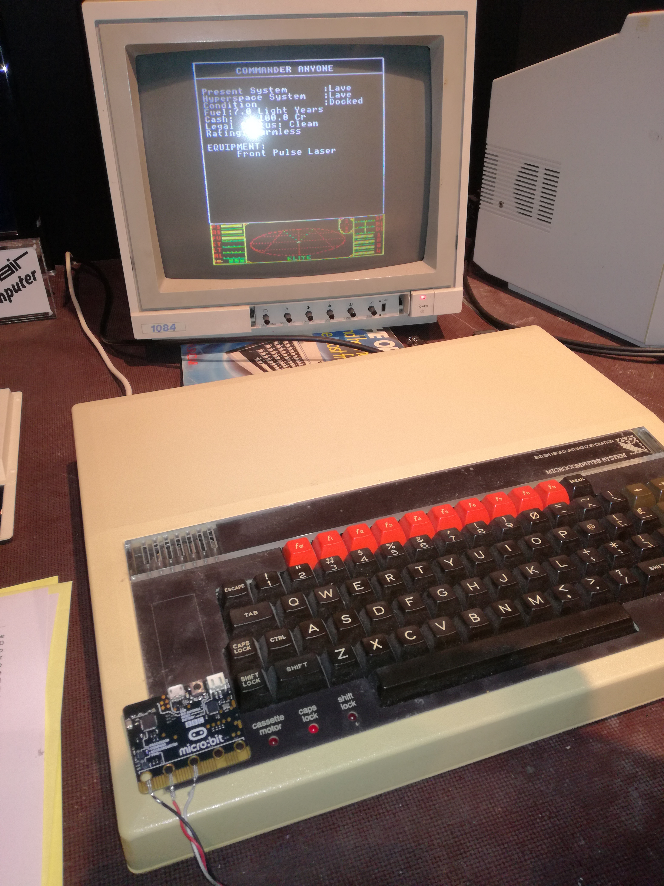
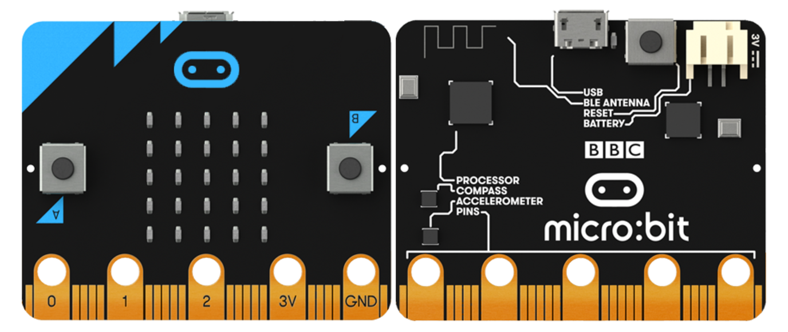

% Python auf dem Micro:Bit
% Tillo Bosshart
% Open Education Day 2018

# Über mich

{ width=50% }

# Python

*   High Level Programmiersprache
*   Ursprünglich aus Bildungsumfeld
*   Einfacher Syntax
*   Eine der meistverwendeten Sprachen im Moment
*   Scientific Stack

# micropython

-   Python3 Reimplementation für Microcontroller
-   ARM (STM32, ATSAM)
-   ESP8266 und ESP32 (billige WiFi fähige Controller)
-   REPL (Kommandozeile)
-   Interaktiv
-   Einfache Interfaces zu der Peripherie

# Was ist ein Microcontroller

-   Kleiner Computer
-   Prozessor und Peripherie (Schnittstellen, ADC, DAC)
-   In Kaffemaschinen, Waschmaschinen, Autos\...

# micro:bit

-   Nachfolger des legendären BBC micro
-   ARM-Lernplattform für Schulen
-   Billig
-   Programmierbar in JavaScript, Python, C, C++

# micro:bit

{ height=70% }

# micro:bit

# Python auf dem micro:bit

-   Webeditor auf <http://python.microbit.org/>
-   Editor downloadbar auf <https://codewith.mu>
-   Beide Varianten benötigen keine Installation

# Features

-   Verschiedene Symbole integriert
-   Sound und Sprachsynthese (!)
-   Kein BT Stack
-   Einfaches Funken über BT PHY

# Links

-   Micropython <https://www.micropython.org>
-   micro:bit <http://www.microbit.org/de/>
-   Micropython auf micro:bit <https://www.microbit-micropython.readthedocs.io/en/latest/>
-   Ein paar Beispiele von mir <https://www.github.com/morgulbrut/microbit-examples>